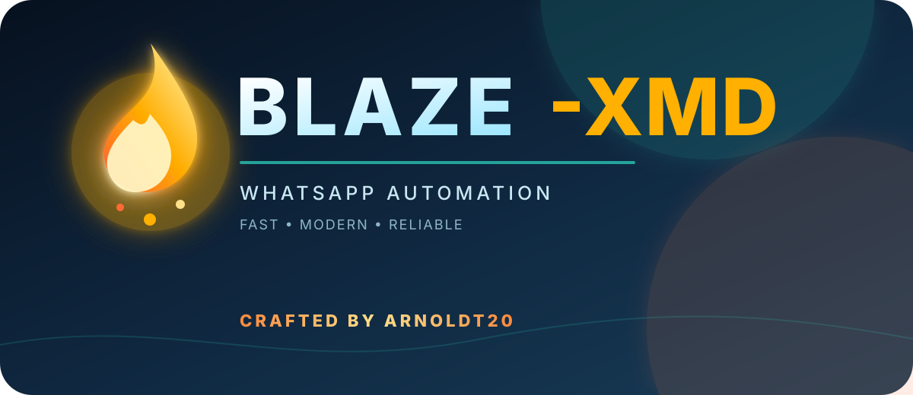

<div align="center">



# BLAZE XMD Skeleton

**A clean, modular WhatsApp bot starter for developers.**

[](https://nodejs.org/)
[](https://github.com/WhiskeySockets/Baileys)
[](#deploy)

</div>

## What this is

BLAZE XMD Skeleton is the reusable foundation behind a styled, plugin-driven WhatsApp bot. It includes the runtime, command registry, configuration layer, database fallback, safe starter plugins, and Heroku worker configuration.

Built to be **forked, renamed, styled, and extended**.

## Included

- Recursive plugin loader with an explicit allow-list
- Styled BLAZE command metadata and menu system
- Editable bot identity and developer credits
- 16 startup plugins: core, fun, group-info, profile, repeat, translate, and weather commands
- Local JSON database fallback with optional PostgreSQL support
- Reusable plugin template in `plugins/Template/example.js`
- Heroku-ready `Procfile` and `app.json`
- Session files excluded from Git by default

## Quick start

```bash
npm install
cp settings.env.example settings.env
# add your session and identity values
npm start
```

To add a command, copy `plugins/Template/example.js`, edit its metadata and handler, then add its path to `plugins.config.json`.

## Deploy

[](https://dashboard.heroku.com/new?template=https://github.com/blazetech-glitch/base-bot)

The Heroku template starts the bot as a worker and exposes the essential environment variables in the deploy form.

## Project credits

Created and styled by:

- **BLAZE Tech / blazetech-glitch** — [GitHub](https://github.com/blazetech-glitch)
- **ARNOLDT20** — [GitHub](https://github.com/ARNOLDT20)

This skeleton is intended for developers who want to build their own compatible bot while preserving the BLAZE XMD plugin style.

<div align="center">

**BLAZE XMD · blazetech-glitch · ARNOLDT20**

</div>
